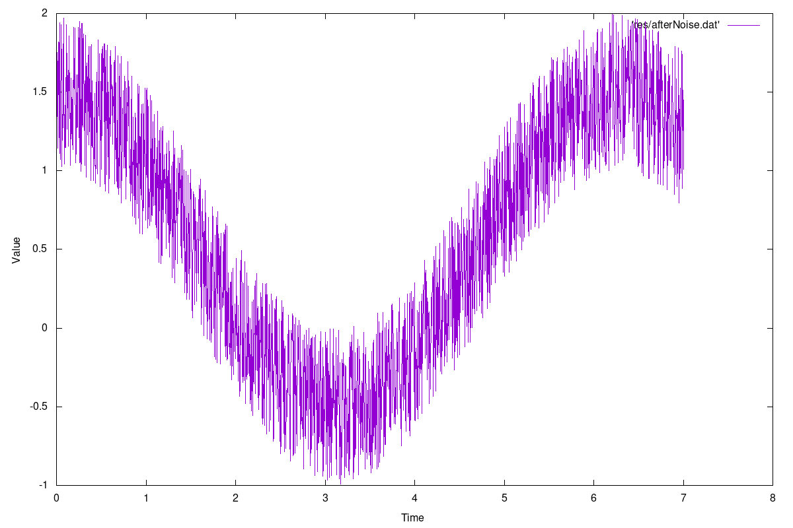

# Fortran - Exercise 2 #

Second homework for Fortran university course focusing on Fast Fourier Transform in Fortran.

## Project Structure ##

	├── Makefile
	├── README.md
	├── res
	│   ├── afterCorrection.dat
	│   ├── afterFFT.dat
	│   ├── afterNoise.dat
	│   ├── afterNoiseFFT.dat
	│   ├── beforeNoise.dat
	│   ├── plot_afterCorrection.png
	│   ├── plot_afterFFT.png
	│   ├── plot_afterNoiseFFT.png
	│   ├── plot_afterNoise.png
	│   ├── plot_timesignal.png
	│   └── timesignal.dat
	└── src
	    ├── deFFT.F90
	    ├── FFT.F90
	    └── gnuplot.sh

Directories explained:

	res/
		contains files: example plots and results.
	src/
		source code inside ™.

## QuickSetup ##

	$ https://github.com/Vetchu/fortran-second_exercise
	$ cd fortran-second_exercise
	$ make #to prepare binaries
	$ make allplot #to generate data and plots
	
### Make - useful bits ###

	$ make clean #to clean binaries
	$ make cleanres #to clean results
	$ make plot #to plot results
	$ make <File> #to prepare binary of particular File
	
## Results ##

Tested Function:

	x = sin(2 ∗ π ∗ t ∗ 200) + 2 ∗ sin(2 ∗ π ∗ t ∗ 400)

### Plot of 1st function###

### Plot of 1st function FFT'd ###

Note: as we can see, most important are frequencies 200 and 400, just as we set in function.

### Plot of second, noisy function cos(x)+rand ###

### Plot of FFT'd second function ###

Note: on this result we apply zeroing of all elements less than 50, giving us next plot by inverse FFT.

### Plot of second function cleaned by FFT ###

## Conclusion ##

As we can see, fast fourier transform allows one to easily get rid of all noises, keeping only slightly distorted original signal (which is cos(x)). In our case it also bumps function up (as seen in the last plot).
